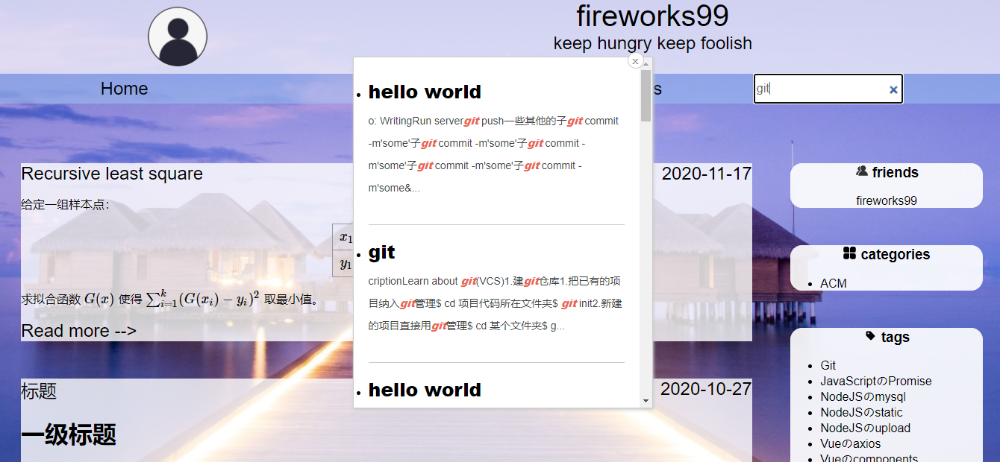
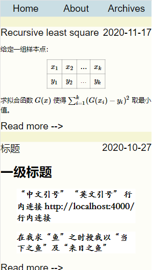
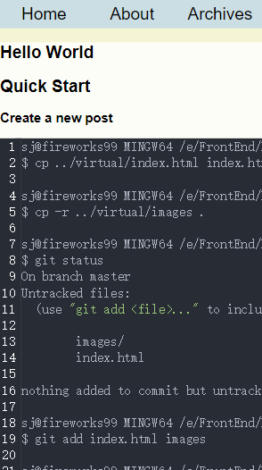

hexo-theme-PreciousJoy

A simple theme made by a newbie.

     

<a href="https://fireworks99.github.io/" style="color:violet;">Demo(github)</a> 

<a href="http://fireworks99.top/" style="color:violet;">Demo(in China)</a> 

## Install

~~~shell
$ cd your-hexo-site
$ git clone https://github.com/fireworks99/hexo-theme-PreciousJoy themes/PreciousJoy
~~~

## And install

~~~shell
$ npm install hexo-generator-search --save
~~~

> A plugin which support you search blogs  in your site

~~~shell
npm uninstall hexo-renderer-marked --save
npm install hexo-renderer-kramed --save
~~~

> To choose a better hexo renderer.
>
> This is important if you'll use LaTex in your blogs.

## Your-hexo-site _config.yml

~~~yaml
# Hexo Configuration
## Docs: https://hexo.io/docs/configuration.html
## Source: https://github.com/hexojs/hexo/

# Site
title: your blog title
subtitle: ''
description: ''
keywords:
author: your name
language: en
timezone: ''

# URL
## If your site is put in a subdirectory, set url as 'http://example.com/child' and root as '/child/'
url: http://example.com
root: /
permalink: :year/:month/:day/:title/
permalink_defaults:
pretty_urls:
  trailing_index: true # Set to false to remove trailing 'index.html' from permalinks
  trailing_html: true # Set to false to remove trailing '.html' from permalinks

# Directory
source_dir: source
public_dir: public
tag_dir: tags
archive_dir: archives
category_dir: categories
code_dir: downloads/code
i18n_dir: :lang
skip_render:

# Writing
new_post_name: :title.md # File name of new posts
default_layout: post
titlecase: false # Transform title into titlecase
external_link:
  enable: true # Open external links in new tab
  field: site # Apply to the whole site
  exclude: ''
filename_case: 0
render_drafts: false
post_asset_folder: true
relative_link: false
future: true
highlight:
  enable: false         # I's important for this theme(PreciousJoy).
  line_number: true
  auto_detect: false
  tab_replace: ''
  wrap: true
  hljs: false
prismjs:
  enable: false
  preprocess: true
  line_number: true
  tab_replace: ''

# Home page setting
# path: Root path for your blogs index page. (default = '')
# per_page: Posts displayed per page. (0 = disable pagination)
# order_by: Posts order. (Order by date descending by default)
index_generator:
  path: ''
  per_page: 5
  order_by: -date

# Category & Tag
default_category: uncategorized
category_map:
tag_map:

# Metadata elements
## https://developer.mozilla.org/en-US/docs/Web/HTML/Element/meta
meta_generator: true

# Date / Time format
## Hexo uses Moment.js to parse and display date
## You can customize the date format as defined in
## http://momentjs.com/docs/#/displaying/format/
date_format: YYYY-MM-DD
time_format: HH:mm:ss
## updated_option supports 'mtime', 'date', 'empty'
updated_option: 'mtime'

# Pagination
## Set per_page to 0 to disable pagination
per_page: 10
pagination_dir: page

# Include / Exclude file(s)
## include:/exclude: options only apply to the 'source/' folder
include:
exclude:
ignore:

theme: PreciousJoy

# Deployment
## Docs: https://hexo.io/docs/one-command-deployment
deploy:
  type: git
  repository: git@github.com:yoursite/yoursite.github.io.git
  branch: master

search:
  path: search.xml
  field: post
  content: true

~~~

> If you modified the _config.yml, remember to run `hexo clean`.

## PreciousJoy _config.yml

~~~yaml

# html lang
language: en

# main menu navigation
menu:
  Home: /
  About: /about
  Archives: /archives

# stylesheets loaded in the <head>
stylesheets:
- /css/PreciousJoy.css
- /css/top-bar.css
- /css/menu-outer.css
- /css/content-outer.css
- /css/bottom-outer.css
- /css/atom-one-dark.css
- /css/recent-posts-item.css
- /css/article-sidebar-toc.css
- /css/jquery.fancybox.min.css
- /css/search.css
- /css/toc.css
- /css/sidebar.css
- /css/archive.css

- /css/Z-last-cover-others.css

# scripts loaded in the end of the body
scripts:
- /js/jquery-3.5.1.min.js
- /js/PreciousJoy.js
- /js/highlight.pack.js
- /js/jquery.fancybox.min.js
- /js/search.js
- /js/load.js

# userinfo
author: fireworks99
slogan: keep hungry keep foolish
avatar: 

# Fancybox support
fancybox: true

# some widgets
widgets:
- blogroll
- category
- tag
- tagcloud
- archive
- recent_posts

# friends
blogroll:
  fireworks99: https://fireworks99.github.io/

Livere:
  livere_uid: 'Your data-uid'

local_search:
  enable: true
  facade: ""

# MathJax Support
mathjax:
  enable: true
  cdn: https://cdnjs.cloudflare.com/ajax/libs/mathjax/2.7.6/MathJax.js?config=TeX-AMS-MML_HTMLorMML
~~~

## Something I want to say

### About LaTex:

> If you want to use Latex in your blogs, you must make sure that the option "mathjax: enable" in PerciousJoy _config.yml is true and keep network available.
>
> Attention:
>
> Add `mathjax: true` at the head when you write an article which used LaTex.
>
> In one line, if the front of the line is `$$` and the end of the line is also the `$$` , don't use `$$` in the line anymore! Or there will be some bugs in rendering LaTex.

### About Avatar:

> Select a picture and move it to `PreciousJoy/source/images/`. Then add path(` '/images/your_picture_name.png'`) in PreciousJoy _config.yml.

### About Code

> Don't slide your cursor over the code which means slide the code to the left or right.

### My English is poor :(

> If you feel it hard to understand what I said, leave me a message.